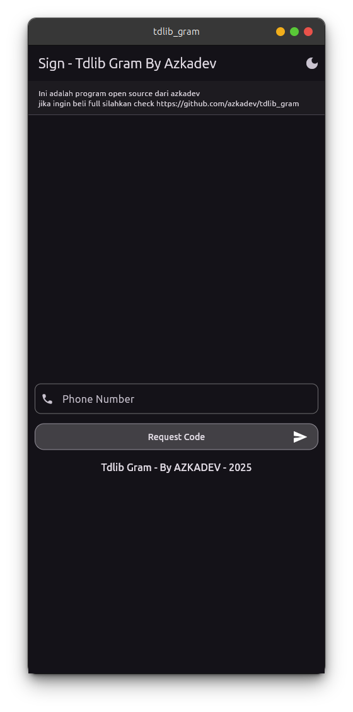
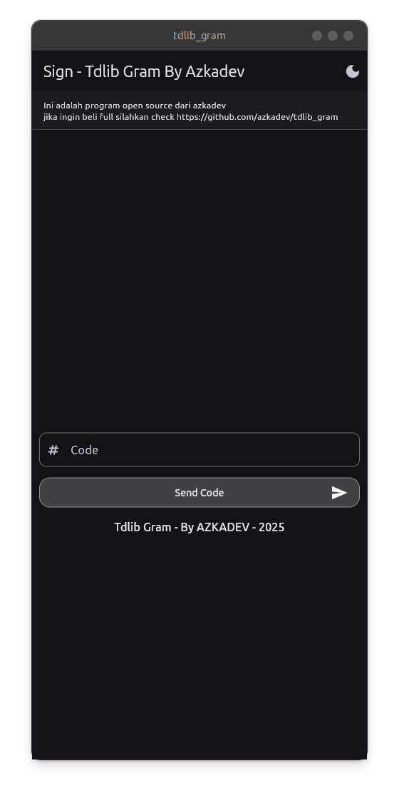
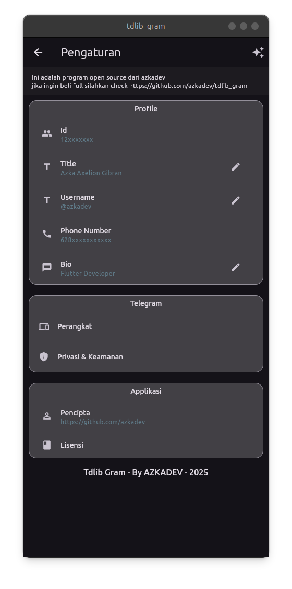
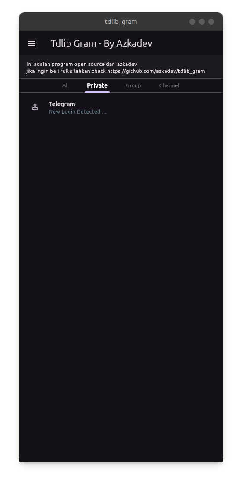
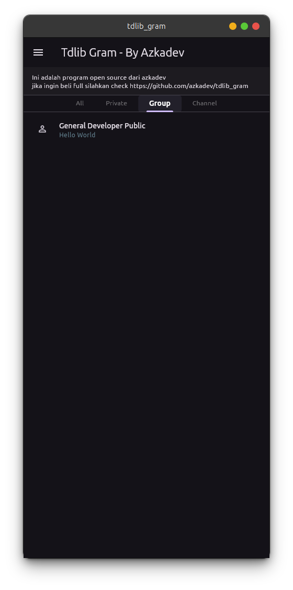
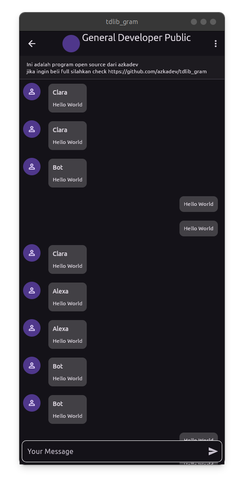

# Tdlib Gram (Untuk Bahan Belajar)

**Sebuah bahan dasar** untuk kamu yang ingin **membuat / berinteraksi** dengan **telegram api** terutama **menggunakan tdlib**, karena sampai saat ini tdlib adalah awalan yang bagus karena kamu tidak hanya bisa membuat **bot** melainkan **applikasi telegram sungguhan**.

**applikasi ini tidak di design bagus** dalam arti ini **hanyalah contoh simple penggunaan library** [Telegram Client](https://github.com/azkadev/telegram_client)

saya membuat ini karena ingin membuatkan contoh penggunaan library saya [Telegram Client](https://github.com/azkadev/telegram_client), saya ingin
mematahkan perkataan seseorang flutter lag apalagi ketika menggunakan ffi

> Ini hanya untuk bahan belajar tidak akan ada update design ui yang mewah / animasi

> Di karenakan kemudahan tdlib, saya tidak bisa update hal hal lebih hanya fitur sederhana saja, karena api telegram sering disalah gunakan

- 🇮🇩 [Indonesia](https://github.com/azkadev/tdlib_gram/blob/main/README.md)
- 🇨🇿 [Afrika](https://github.com/azkadev/tdlib_gram/blob/main/README_AFRIKA.md)
- 🇨🇳 [China](https://github.com/azkadev/tdlib_gram/blob/main/README_CHINA.md)
- 🏴󠁧󠁢󠁥󠁮󠁧󠁿 [English](https://github.com/azkadev/tdlib_gram/blob/main/README_ENGLISH.md)
- 🇮🇳 [India](https://github.com/azkadev/tdlib_gram/blob/main/README_INDIA.md)
- 🇮🇩 [Jawa](https://github.com/azkadev/tdlib_gram/blob/main/README_JAWA.md)
- 🇯🇵 [Jepang](https://github.com/azkadev/tdlib_gram/blob/main/README_JEPANG.md)
- 🇰🇷 [Korea](https://github.com/azkadev/tdlib_gram/blob/main/README_KOREA.md)
- 🇷🇺 [Russia](https://github.com/azkadev/tdlib_gram/blob/main/README_RUSSIA.md)
- 🇮🇩 [Sunda](https://github.com/azkadev/tdlib_gram/blob/main/README_SUNDA.md)
- 🇹🇭 [Thailand](https://github.com/azkadev/tdlib_gram/blob/main/README_THAILAND.md)

## Screenshot

ini adalah screenshot di buat pada tanggal **24-juli-2025** mungkin **tampilan berbeda jika kamu menggunakan versi open source**

| 1                                   | 2                                   | 3                                   |
|-------------------------------------|-------------------------------------|-------------------------------------|
|  |  |  |
|  |  |  |
|  |                                     |                                     |

## Penting

untuk semuanya ini adalah program yang mungkin bisa di salahgunakan sebagian orang, oleh karena itu saya tidak mengimplementasi bagian penting

Ini bukan lah penipuan repository ini hanyalah sebuah contoh penggunaan library saya [Telegram Universe](https://github.com/azkadev/telegram_client).

**sebelum menggunakan program** ini pastikan **akun kamu sudah akun lama** dan **aktif chat di group ya**. 

Jika tidak misal akun kamu baru kemungkinan akan di **banned** oleh **telegram** hal ini karena **telegram sering di pakai spam / scam** sehingga akun baru yang baru login **applikasi pihak 3** bisa langsung di **banned** walaupun **tidak melakukan spam / scam / tindakan buruk lainya**

## Applikasi yang sudah di compile dan sudah bisa di jalankan

saya sudah mencoba dan menjalankan pada perangkat saya, tetapi tidak semua arsitektur, 
**mobile hanya arch64 desktop hanya intel dan amd**, selain itu ya bisa saja akan tetapi kamu perlu **compile ulang** termasuk **tdlib**

1. [x] [Android](https://github.com/azkadev/tdlib_gram/releases/tag/apps)
2. [x] [Ubuntu 24 Linux](https://github.com/azkadev/tdlib_gram/releases/tag/apps)
3. [ ] [Windows 11](https://github.com/azkadev/tdlib_gram/releases/tag/apps)
4. [ ] [Web](https://github.com/azkadev/tdlib_gram/releases/tag/apps)
5. [ ] [MacOS](https://github.com/azkadev/tdlib_gram/releases/tag/apps)
6. [ ] [IOS](https://github.com/azkadev/tdlib_gram/releases/tag/apps)

## Fakta Menarik

berikut ini adalah beberapa fakta yang mungkin menarik untuk kamu

1. [x] **Tidak memakai state management** / widget pihak 3 **semuanya langsung dari flutter**
2. [x] **Tidak terikat banyak dependencies** / library pihak 3

## Pengembangan

Untuk mengembangkan project ini pastikan kamu memiliki pengetahuan tentang bahasa code [dart](https://dart.dev) dan juga framework [flutter](https://flutter.dev)

setelah mengetahui dasar pastikan kamu memahami library [Telegram Client](https://github.com/azkadev/telegram_client)

setelah itu cobalah buka project ini di flutter dan rubah code mana yang kamu ingin rubah

- [Blog Website](https://azkadev.netlify.app/blogs?id=tdlib_gram&ref=github)
  jika kamu masih bingung dan ingin tahu bagaimana saya mengembangkan program ini check website diatas

## Masih Kurang

**tidak puas karena applikasi ini minimalist ingin fitur lebih?**

Baca ini [Versi Lebih Lengkap](https://github.com/azkadev/tdlib_gram/blob/main/extra)

## Masih Terasa Lag?

sebenernya di katakan **lag** tidak juga, tapi jika kamu **berhasil memodif library** ini dan ya kamu menggunakan banyak client sekaligus, memang kamu benar terkait pernyataan ini. itu **bukan** karena **flutter / ffi**. melainkan **TDLIB** yang memang boros sumber daya apalagi untuk **membuat user dalam jumlah besar**, secara default **TDLIB** memang menyimpan **memory** dan sering menulis ke **disk**, ini yang membuat lag, karena tdlib di design sangat mudah.

> Jika kamu ingin menggunakan tdlib, gunakan hanya satu client saja untuk 1 program, karena jika lebih penggunaan memory akan sulit turun, terutama jika kamu masih pemula

Jika kamu masih merasa tdlib tidak cocok untuk project kamu, coba beralih ke repository [Azkadev Gram](https://github.com/azkadev/showcase_azkadev_gram) yang akan datang disana walaupun saya menggunakan tdlib, saya berhasil memodif tdlib sehingga bisa berjalan dengan sangat baik

## Bantu Saya

Jika kamu merasa program ini berguna, kamu bisa support saya [GITHUB AZKADEV](https://github.com/azkadev) di link itu tersedia social media dan sponsor saya. saya tidak keberatan jika kamu hanya follow / donasi uang sedikit

- https://www.patreon.com/c/azkadev
- https://opencollective.com/azkadev
- https://paypal.me/azkaaxeliongibran
- https://paypal.me/azkadev

Terimakasih

Azkadev - 24-07-2025

## Tags

- telegram dart
- telegram flutter
- tdlib telegram
- tdlib telegram
- tdlib gram
