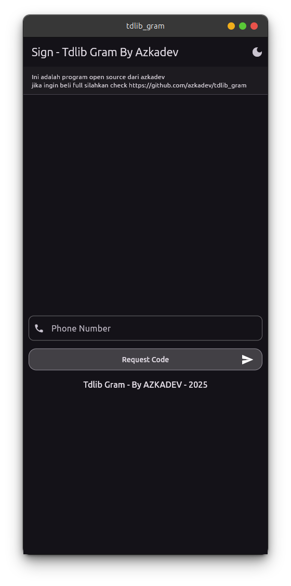
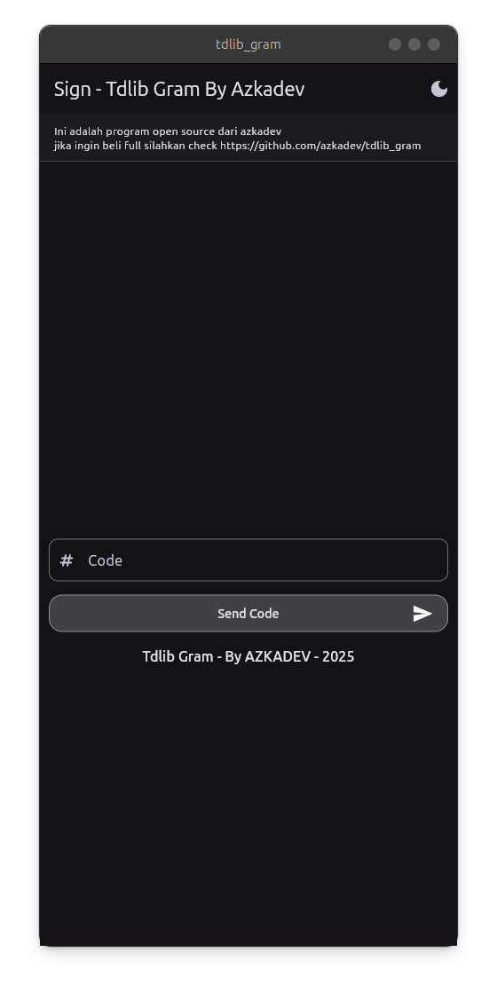
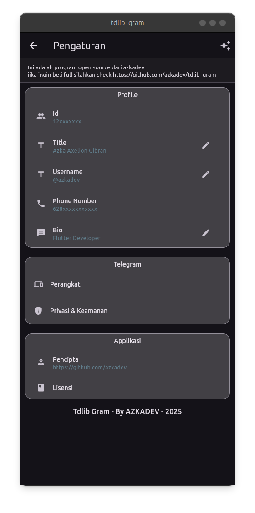
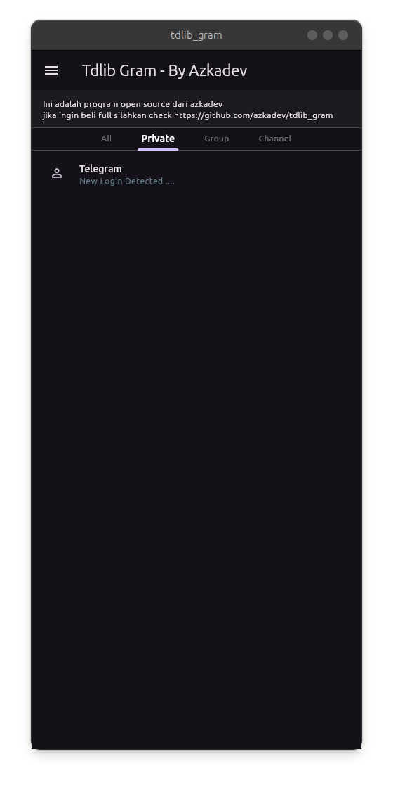
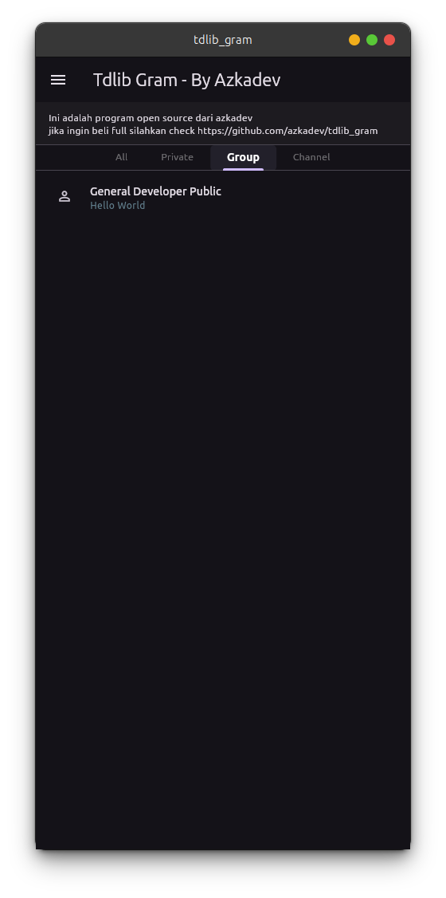
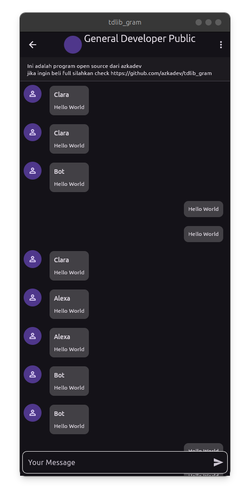

# Bacaan Lebih banyak

**applikasi ini pada dasarnya bisa di compile untuk umum namun fitur terbatas**

Kenapa?

- **Tindakan kejahatan**
  karena sangat mudah digunakan maka tdlib rentan untuk di gunakan hal hal buruk. 
  scam / spam / phising dan tindakan buruk lainya.

  selain karena kemudahan tdlib, flutter sebagai framework juga sangat mudah jadi saya juga khawatir tentang ini

- **Bisnis Orang lain terdampak**
  pada dasarnya banyak orang yang mahir dan menggunakan telegram untuk bisnis, sehingga jika saya menaruh semua codenya maka bisnis lain akan terdampak.
  dan kemungkinan saya menjadi target sasaran. walaupun pada dasarnya saya tidak peduli, tapi saya mematuhi etika, karena itu tindakan buruk juga

## Penting

**sebelum menggunakan program** ini pastikan **akun kamu sudah akun lama** dan **aktif chat di group ya**. 

Jika tidak misal akun kamu baru kemungkinan akan di **banned** oleh **telegram** hal ini karena **telegram sering di pakai spam / scam** sehingga akun baru yang baru login **applikasi pihak 3** bisa langsung di **banned** walaupun **tidak melakukan spam / scam / tindakan buruk lainya**
 
## Tangkapan Layar

| 1                                   | 2                                   | 3                                   |
|-------------------------------------|-------------------------------------|-------------------------------------|
|  |  |  |
|  |  |  |
|  |                                     |                                     |

## Apa saja variant berbayar yang bisa dapatkan

variant saya biasa menggunakan 3 variant untuk jualan

- **Regular**
    
  - [Unduh Install Secara Gratis](https://github.com/azkadev/tdlib_gram/releases/tag/apps)

  - **Fitur**
    - [x] Pengaturan Terbuka
    - [ ] Dapat Melihat Foto Profile Pengguna lain
    - [ ] Dapat Melihat nama Profile Pengguna lain
    - [ ] Dapat Melihat Kontent Pesan Media
    - [ ] Dapat Melihat Member Group
    - [ ] Dapat Melihat Recent Actions Group
    - [ ] Bisa Mereply Pesan Orang Lain
    - [ ] Bisa Melakukan Pencarian Profile
    - [ ] Sekaligus Client / Tidak ada batasan akun login bersamaan
  
  - **Harga**
    - Indonesia: Rp100.000
    - Lainya: $7

- **Premium**

  - [Unduh Install Secara Gratis](https://github.com/azkadev/tdlib_gram/releases/tag/apps)
  
  - **Fitur**
    - [x] Pengaturan Terbuka
    - [ ] Dapat Melihat Foto Profile Pengguna lain
    - [x] Dapat Melihat nama Profile Pengguna lain
    - [ ] Dapat Melihat Kontent Pesan Media
    - [x] Dapat Melihat Member Group
    - [ ] Dapat Melihat Recent Actions Group
    - [ ] Bisa Mereply Pesan Orang Lain
    - [x] Bisa Melakukan Pencarian Profile
    - [ ] Sekaligus Client / Tidak ada batasan akun login bersamaan

  - **Harga**
    - Indonesia: Rp500.000
    - Lainya: $31

- **Ultra**
  
  - [Unduh Install Secara Gratis](https://github.com/azkadev/tdlib_gram/releases/tag/apps)
  
  - **Fitur**
    - [x] Pengaturan Terbuka
    - [x] Dapat Melihat Foto Profile Pengguna lain
    - [x] Dapat Melihat nama Profile Pengguna lain
    - [x] Dapat Melihat Kontent Pesan Media
    - [x] Dapat Melihat Member Group
    - [x] Dapat Melihat Recent Actions Group
    - [x] Bisa Mereply Pesan Orang Lain
    - [x] Bisa Melakukan Pencarian Profile
    - [x] Sekaligus Client / Tidak ada batasan akun login bersamaan

  - **Harga**
    - Indonesia: Rp1.000.000
    - Lainya: $62

## Cara Pembelian

- Indonesia
  
  jika kamu orang indonesia kamu bisa mendownload applikasi ini.

  setelah itu login pakai google

- Lainya
  saya tidak memiliki payment automatis untuk negara luar, sehingga ketika kamu sudah mengtransfer, kamu perlu chat saya di group ini

  - Hanya Paypal: https://paypal.me/azkaaxeliongibran

- Bantuan Jika memiliki kendala
  jika ragu silahkan chat dahulu dan konfirmasi kesaya ya saya ada di group itu
  - [Telegram](https://t.me/DEVELOPER_GLOBAL_PUBLIC)
  - [Discord](https://discord.gg/h4qanyN7)

## Pertanyaan

> Q: Jika tidak sesuai apakah bisa refund?
> A: Maaf saya sudah menyediakan applikasi yang sudah di pakai, sebelum membeli pastikan kamu mencoba dahulu, jika cocok
maka bayar jika tidak ya skip aja

> Q: Apakah semuanya sama tidak terikat library pihak 3?
> A: Ya sama, saya hanya membuatkan fitur yang terbuka, jadi tidak perlu library pihak ke 3 lainya

> Q: Saya ingin lebih dari ini apakah bisa?
> A: Maaf tidak bisa, saya sibuk, namun jika ada pertanyaan bisa di tanyakan ke group jika butuh bantuan, bisa chat aja secara gratis